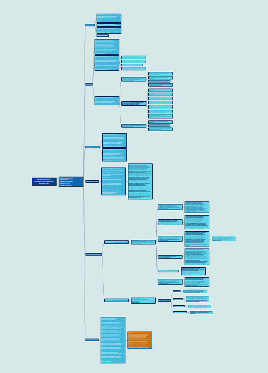

# Практическая работа № 5

## Цель работы

Изучить ГОСТ по защите информации и познакомиться с построением mindmap

### Ход работы

1. Для построения mind-карты был взят ГОСТ Р 59710-2022 Защита информации. Управление компьютерными инцидентами. Общие положения.

     Ссылка на документ - https://docs.cntd.ru/document/1200194356 
2. Была использована программа Freeplane

3. Результат

#### Оценка результата

Был изучен ГОСТ Р 59710-2022 Защита информации. Управление компьютерными инцидентами. Общие положения и была построена mindmap в программе Freeplane.

##### Вывод

Таким образам был изучет ГОСТ и познакомились с посторением mindmap.
